# Denis Dambek

**Full-stack ML Engineer** · AI products · CV/NLP · LLM systems

<a href="https://t.me/Dambek0">Telegram</a> · <a href="mailto:denolinevichd@inbox.ru">denolinevichd@inbox.ru</a>

---

<table>
  <tr>
    <td width="58%">
      <b>Profile</b>  
      Я фуллстек ML-разработчик. Проектирую AI-продукты end-to-end:
      от модели, данных и inference-пайплайна до backend API, интерфейса и деплоя.
    </td>
    <td width="42%">
      <b>Focus</b>  
      Applied ML · LLM/NLP · Computer Vision 
      AI assistants · Production-ready services 
      Product engineering · Clean web UX
    </td>
  </tr>
</table>

### Engineering Stack

<table>
  <tr>
    <td width="18%"><b>ML</b></td>
    <td><code>PyTorch</code> <code>Transformers</code> <code>CV</code> <code>NLP</code> <code>LLM</code></td>
  </tr>
  <tr>
    <td><b>Backend</b></td>
    <td><code>Python</code> <code>FastAPI</code> <code>SQL</code> <code>Docker</code></td>
  </tr>
  <tr>
    <td><b>Frontend</b></td>
    <td><code>TypeScript</code> <code>Next.js</code> <code>React</code></td>
  </tr>
  <tr>
    <td><b>Core</b></td>
    <td><code>C++</code> <code>Linux</code> <code>Git</code></td>
  </tr>
</table>

### Selected Achievements

<table>
  <tr>
    <td width="18%"><b>2026</b></td>
    <td>Data Fusion winner, special nomination</td>
  </tr>
  <tr>
    <td><b>2026</b></td>
    <td>НТО: абсолютный победитель по инфохимии</td>
  </tr>
  <tr>
    <td><b>2026</b></td>
    <td>IO prize-winner; DANO 2025 finalist</td>
  </tr>
  <tr>
    <td><b>2025/26</b></td>
    <td>НТО finalist: financial technologies, AI, infochemistry</td>
  </tr>
  <tr>
    <td><b>AI</b></td>
    <td>Всероссийская олимпиада по ИИ semifinalist; Sirius AI prize-winner with Damfai</td>
  </tr>
  <tr>
    <td><b>Hackathons</b></td>
    <td>Tulahack, Codewars, Smolathon winner; Computeriada, Осень 25, Nuclear Hack and О! Хакатон prize-winner</td>
  </tr>
  <tr>
    <td><b>VSOSH</b></td>
    <td>Regional prize-winner in physics, computer science, chemistry and mathematics</td>
  </tr>
</table>

### Education

<table>
  <tr>
    <td width="18%"><b>2025</b></td>
    <td>
      Институт дополнительного образования Иннополис 
      «Искусственный интеллект и основы аналитики (больших) данных»
    </td>
  </tr>
</table>

---

Building practical AI systems from model to product.

