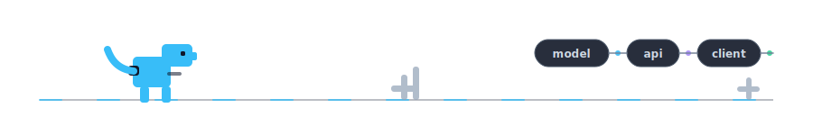

# Denis Dambek

<samp>full-stack ml developer · ai products · cv/nlp · web systems</samp>

  

<samp>python · typescript · next.js · pytorch · transformers · c++</samp>

  

<samp>
  <a href="https://t.me/Dambek0">telegram</a> ·
  <a href="mailto:denolinevichd@inbox.ru">email</a>
</samp>

  

---

### Коротко

Я фуллстек ML-разработчик. Собираю AI-продукты end-to-end: от модели, данных и inference-пайплайна до API, веб-интерфейса и деплоя.

Мой основной фокус: прикладной ML, LLM/NLP, computer vision, AI-ассистенты и сервисы, которые можно довести до реального продукта, а не оставить на уровне демо.

### Стек

`ML` PyTorch · Transformers · CV · NLP · LLM 
`Backend` Python · FastAPI · SQL · Docker 
`Frontend` TypeScript · Next.js · React 
`Core` C++ · Linux · Git

### Достижения

- Data Fusion 2026: победитель в специальной номинации
- НТО 2026: абсолютный победитель по инфохимии; финалист 2025/26 по финтеху, ИИ и инфохимии
- IO 2026: призёр; DANO 2025: финалист
- AI: полуфиналист Всероссийской олимпиады по ИИ, призёр Сириус ИИ с проектом Damfai
- Хакатоны: победитель Tulahack, Codewars, Smolathon; призёр Компьютериады, Осень 25, Nuclear Hack и О! Хакатон
- ВСОШ: призёр регионального этапа по физике, информатике, химии и математике

### Образование

Институт дополнительного образования Иннополис, 2025 
«Искусственный интеллект и основы аналитики (больших) данных»

---

building practical AI systems from model to product

